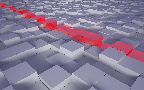
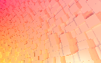
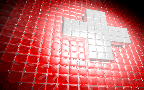

Povray Scenes
================

A collection of my povray experiments.

Build a project's image versions:
-------------------------------------

Each project must contain the following structure:

```
scenes/[projectname]/
  |- Makefile
  |- [projectname].pov
  |- [projectname].ini
```

The Project ini file must contain the following sections, which are called by the Makefile if needed:

* `[low]`: A low-quality rendering for scene preview (probably quality level 8 or below)
* `[thumb]`: A Thumbnail image, about 144x90px in size
* `[prev]`: A preview version in full quality, about 800x500px 
* `[hd]`: A Full HD (1920x1280) version in full quality
* `[wqhd]`: A Wide Quad HD Version (2560x1440) in full quality
* `[4k]`: A 4k UHD (3840x2160) version in full quality

Then you can build each image by calling `make`:

```
$ cd scenes/[projectname]
$ make thumb

#or if you want to build all images:
$ make all
```

Build thumbs
--------------

Build a thumb from each project and copies it to the `thumbs/` folder:

`$ make thumbs`


Available scenes
-----------------

| scene | prev |
|-------|------|
|[plane1](scenes/plane1/plane1.pov) ||
|[plane2](scenes/plane2/plane2.pov) ||
|[swiss_flag](scenes/swiss_flag/swiss_flag.pov) ||
